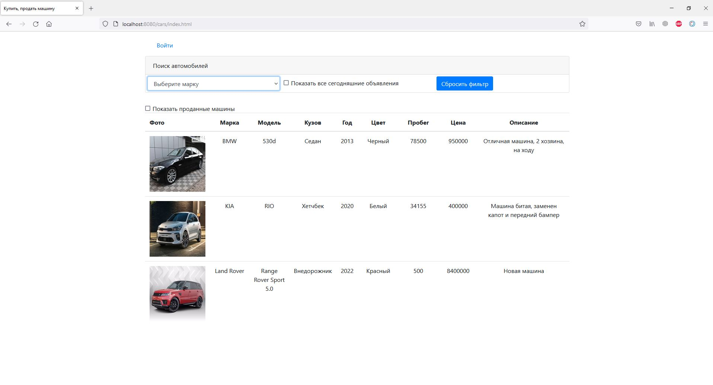
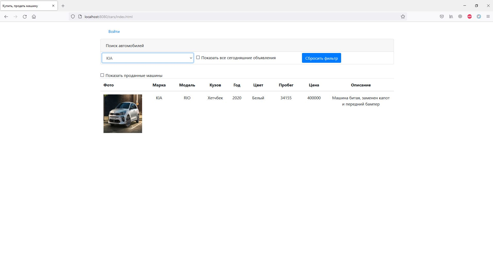
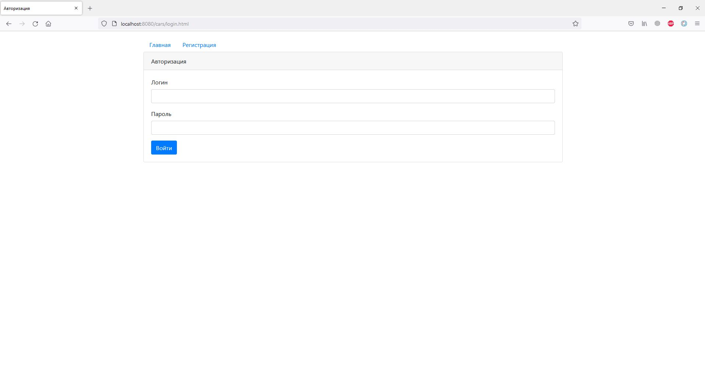
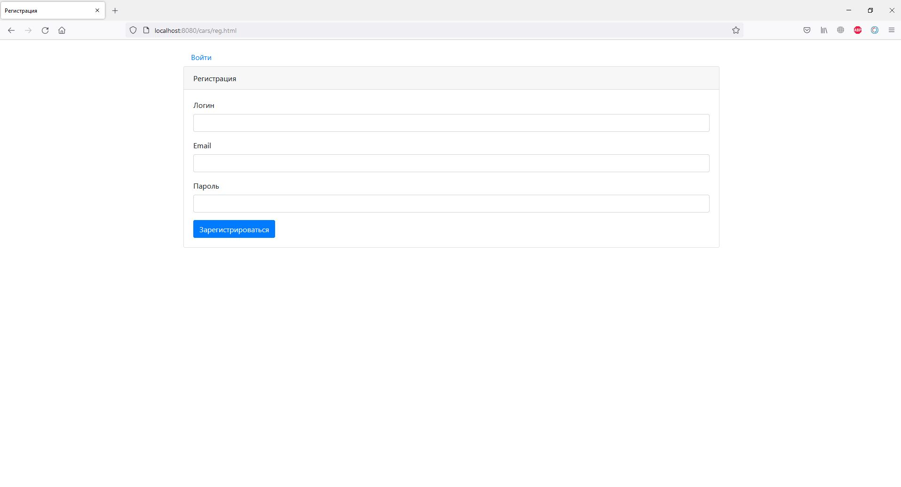
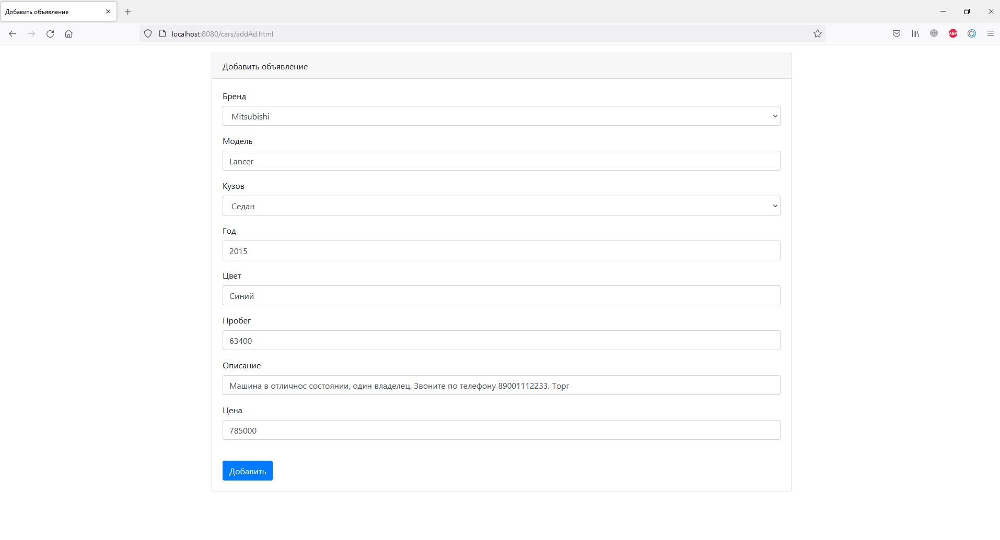
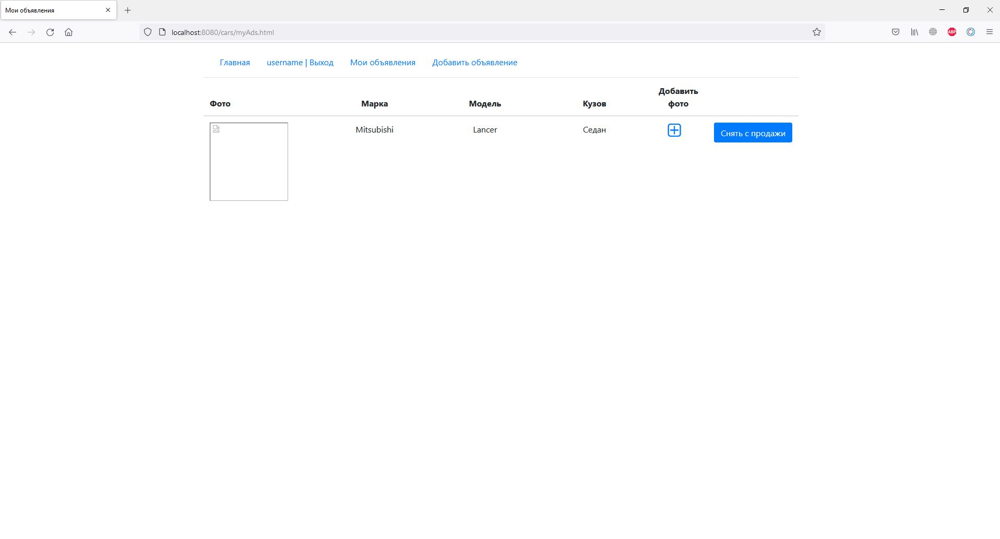
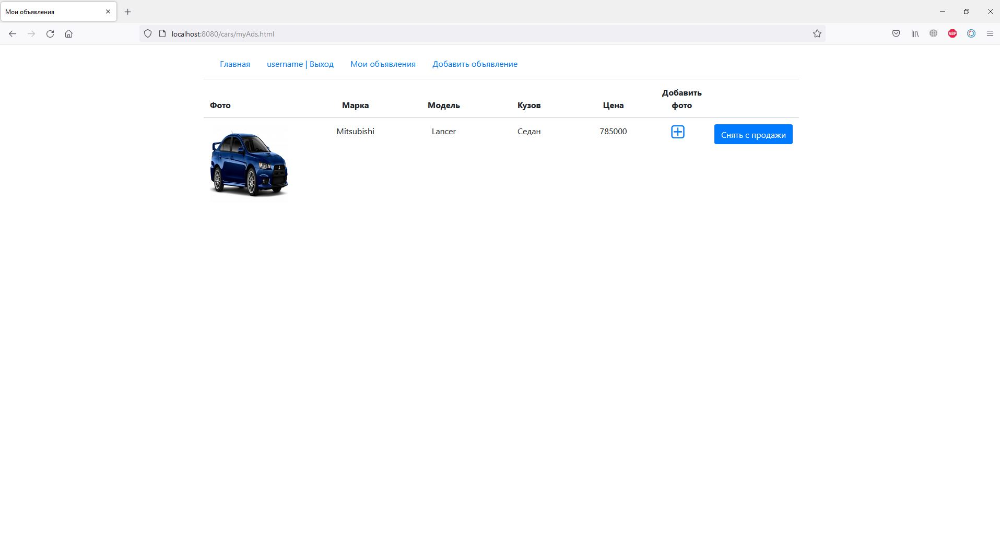
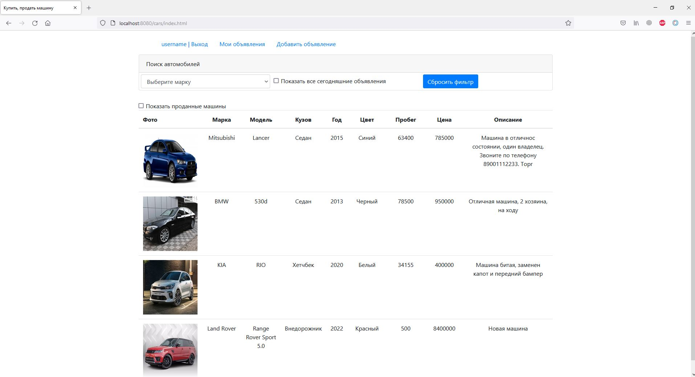

## Описание
Приложение для размещения объявлений о продаже автомобилей.

В приложении реализованы:
* авторизация и регистрация пользователей;
* добавление объявлений и их закрытие;
* фильтрация объявлений:
  * по марке авто;
  * за последние сутки;
  * просмотр закрытых объявлений;
* добавление фото объявления.

## Технологии
* Java 14
* PostgreSQL, HSQLDB
* Hibernate
* HTML, BOOTSTRAP, JS, JQUERY, AJAX
* JUnit
* Slf4j, Log4j

